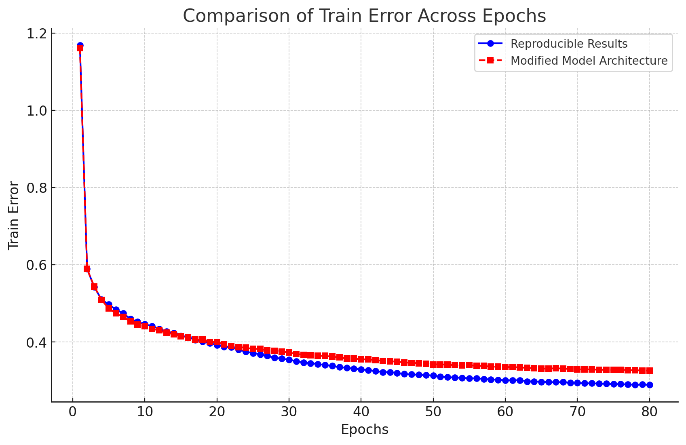
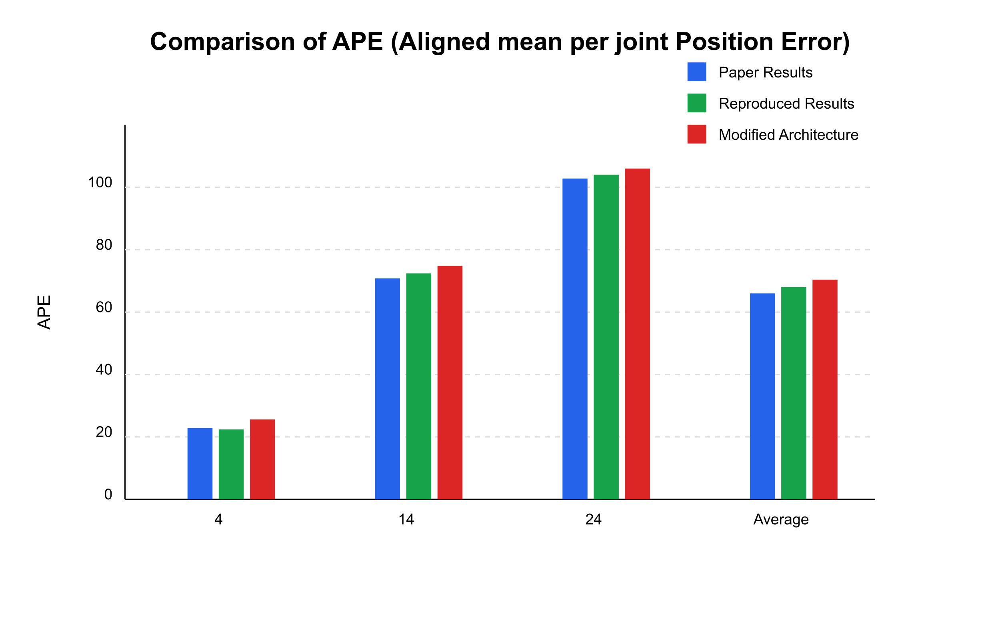

# IAFormer-exp

I am experimenting with the original architecture.  

## Model Dataflow


This architecture has two main modules:  
- **Interaction Perception Module (IPM)**  
- **Interaction Prior Learning Module (IPLM)**  

### Interaction Perception Module (IPM)

IPM generates two matrices:  
- **Amplitude Matrix**  
- **Interaction Trajectory**  

These matrices are used to calculate the degree of influence in interaction for each person.  

---

## Experiment

To calculate the Amplitude Matrix, the input spatial skeleton is first transformed into feature space using Discrete Cosine Transform (DCT) and a Multi-Pose Encoder.  

The Multi-Pose Encoder utilizes self-attention in a TransformerEncoder, which has been modified to use **Temporal Hierarchical Attention** to better capture hierarchical features.  

### Results

**Training Comparison:**  
  

**APE Comparison:**  
  


---


Accepted by European Conference on Computer Vision (ECCV2024)
## Overview
Human Pose Forecasting is a major problem in human intention comprehension that can be addressed through learning the historical poses via deep methods. However, existing methods often lack the modeling of the person's role in the event in multi-person scenes. This leads to limited performance in complicated scenes with variant interactions happening at the same time. In this paper, we introduce the Interaction-Aware Pose Forecasting Transformer (IAFormer) framework to better learn the interaction features. With the key insight that the event often involves only part of the people in the scene, we designed the Interaction Perceptron Module (IPM) to evaluate the human-to-event interaction level. With the interaction evaluation, the human-independent features are extracted with the attention mechanism for interaction-aware forecasting. In addition, an Interaction Prior Learning Module (IPLM) is presented to learn and accumulate prior knowledge of high-frequency interactions, encouraging semantic pose forecasting rather than simple trajectory pose forecasting. We conduct experiments using datasets such as CMU-Mocap, UMPM, CHI3D, Human3.6M, and synthesized crowd datasets. The results demonstrate that our method significantly outperforms state-of-the-art approaches considering scenarios with varying numbers of people.

## Dataset and Environment
CMU-Mocap(UPMP) and Synthesized crowd datasets （Mix1 and Mix2）from [TBIFormer](https://github.com/xiaogangpeng/TBIFormer)

Human3.6M from their [official website](http://vision.imar.ro/human3.6m/description.php)

CHI3D from their [official website](https://ci3d.imar.ro/chi3d)

Experiments base on Cuda 11.8 and Python 3.9 （Perhaps not limited to these versions）
```
project_folder/
├── Dataset/
│   ├── Mocap
│   │   ├── train_3_75_mocap_umpm.npy
│   │   ├── test_3_75_mocap_umpm.npy
│   ├── Crowd
│   │   ├── mix1_6persons.npy
│   │   ├── mix2_10persons.npy
├── Dataset_tools/
│   ├── Dataset_Mocap.py
├── option/
│   ├── option_Mocap.py
├── model/
│   ├── checkpoint
│   │   ├── ...
│   ├── codebook
│   │   ├── ...
│   ├── layers
│   │   ├── ...
│   ├── IAFormer.py
├── model/
│   ├── main_Mocap.py
├── utils/
│   ├── ...
```
## Train
our demo on CMU-Mocap(UMPM) and Synthesized crowd datasets can be download from [here](https://drive.google.com/drive/folders/1GZPz_wv2Pw7F38Xc9PKUH6f-zNHwnlXU?usp=share_link)

change opt.mode to `'train'` in `option_Mocap.py`
```
cd source
python main_Mocap.py
```
## Test
change opt.mode to `'test'` in `option_Mocap.py`
```
cd source
python main_Mocap.py
```
To change the test dataset, comment and uncomment the following line in `Dataset_Mocap.py`
```
self.data=np.load('../Dataset/Mocap/test_3_75_mocap_umpm.npy')
# self.data=np.load('../Dataset/Crowd/mix1_6persons.npy')
# self.data=np.load('../Dataset/Crowd/mix2_10persons.npy')
```
## Citation
@inproceedings{xiao2025multi,
  title={Multi-person Pose Forecasting with Individual Interaction Perceptron and Prior Learning},
  author={Xiao, Peng and Xie, Yi and Xu, Xuemiao and Chen, Weihong and Zhang, Huaidong},
  booktitle={European Conference on Computer Vision},
  pages={402--419},
  year={2025},
  organization={Springer}
}

## Thanks
[TBIFormer](https://github.com/xiaogangpeng/TBIFormer)

[PGBIG](https://github.com/705062791/PGBIG)
